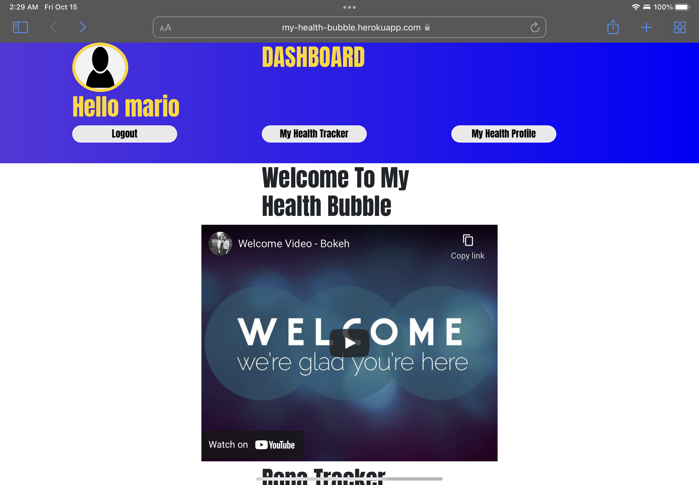
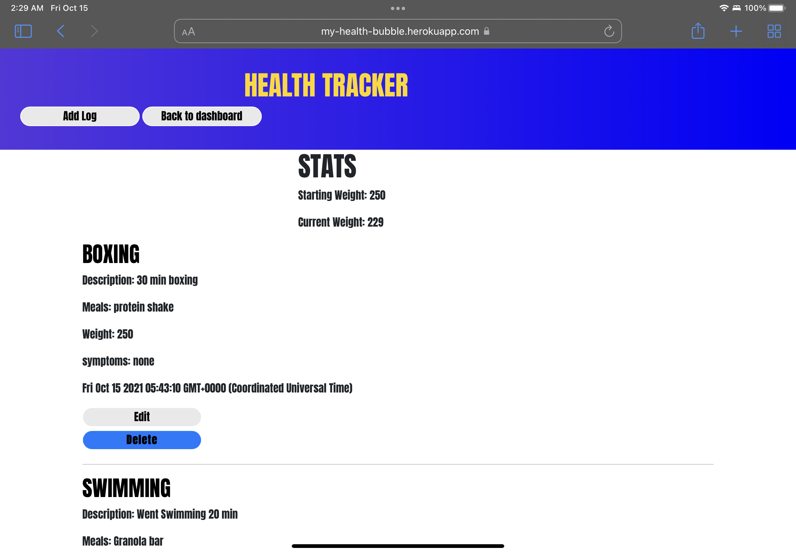

# My Health Bubble
My health bubble is an all in one health app.
Keep track of your meals , weight, and activities.
Helping you keep track of your progress. 

### [Click here for the live app!](https://my-health-bubble.herokuapp.com/)
# Technologies Used
- Node.js
- Express
- MongoDB
- Mongoose
- JavaScript
- HTML
- CSS
- Bootstrap
- Google Fonts
- Authentication with Bcyrpt

# Screenshot(s)

# Getting Started 
You need to connect to your own database.
Make sure Dependacies are installed.
Sign up as a user and then log in.
Dashboard will be the central hub that you will be able to access everything from. Enjoy the app!

# Future Enhancements
- Chat Room with Socket.io 
- Rona Tracker 
- Appointment Setter with Doctors
- UI Updates
- Personalized Stats
- Profile Customization
- Symptom Checker